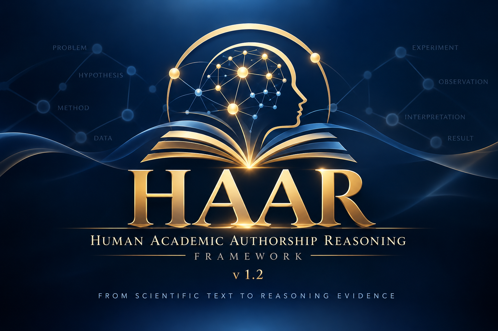
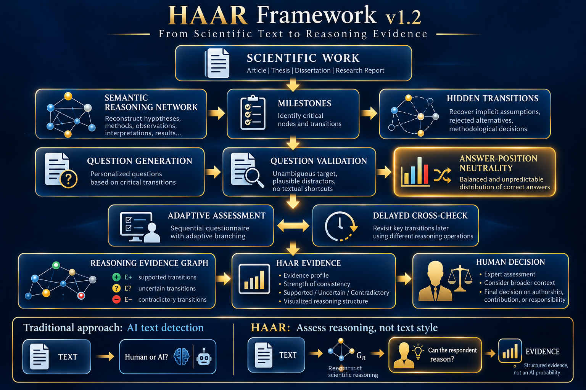

# HAAR Framework v1.2

<p align="center">
  
</p>

<p align="center">
  <b>Human Academic Authorship Reasoning</b><br>
  From Scientific Text to Reasoning Evidence
</p>

> **HAAR → EVIDENCE**  
> **HUMAN → DECISION**

> **HAAR → EVIDENCE**\
> **HUMAN → DECISION**

© Dmytro Lande, September 2026. All rights reserved.

------------------------------------------------------------------------

## Overview

**HAAR (Human Academic Authorship Reasoning)** is a framework for
evidence-based assessment of how well a person claiming authorship of a
scientific or academic work commands the scientific reasoning underlying
that work.

HAAR does **not** primarily attempt to determine whether a text was
written by a human or generated with an AI system. Instead, it
reconstructs the reasoning represented in the submitted work and
evaluates whether the respondent can **reconstruct, justify, challenge,
transform, and extend** its critical scientific transitions.

The framework is based on:

-   reconstruction of a **Semantic Reasoning Network**;
-   identification of **milestones** and critical transitions;
-   reconstruction of **hidden transitions** and rejected alternatives;
-   generation of a personalized questionnaire;
-   validation of questions and plausible distractors;
-   **Answer-Position Neutrality**;
-   sequential adaptive assessment;
-   the **Anti-Coaching Principle**;
-   **Delayed Cross-Check**;
-   construction of a **Reasoning Evidence Graph**;
-   generation of a structured evidence profile;
-   final interpretation by a human assessor.

HAAR does not produce an "AI percentage" or an automatic authorship
probability.

\[ S\_{`\mathrm{HAAR}`{=tex}}
`\neq `{=tex}P(`\mathrm{authorship}`{=tex}) \]

------------------------------------------------------------------------

## Core Idea

Traditional AI-text detection asks:

``` text
TEXT → Human or AI?
```

HAAR asks a different question:

``` text
TEXT → SCIENTIFIC REASONING → ASSESSMENT → EVIDENCE
```

The central operational question is:

> **Can the respondent reconstruct, justify, challenge, transform, and
> extend the critical scientific reasoning represented by the work?**

This distinction can be summarized as:

``` text
Text Authorship ≠ Reasoning Ownership ≠ Scientific Responsibility
```

------------------------------------------------------------------------


## HAAR v1.2 Architecture

The complete HAAR workflow transforms a scientific work into a structured
reasoning-evidence profile while preserving the final decision for a human assessor.

<p align="center">
  
</p>

**Figure 1. HAAR Framework v1.2 architecture — from scientific work to reasoning evidence and human decision.**

The architecture combines Semantic Reasoning Network reconstruction,
milestone detection, hidden-transition analysis, question generation and
validation, Answer-Position Neutrality, adaptive assessment, Delayed
Cross-Check, and construction of the Reasoning Evidence Graph.

The fundamental separation remains:

**HAAR → EVIDENCE**  
**HUMAN → DECISION**

## Semantic Reasoning Network

HAAR transforms the submitted scientific work into a typed reasoning
network

\[ G_R=(V,E,`\tau`{=tex}\_V,`\tau`{=tex}\_E,w) \]

whose nodes represent elements of scientific reasoning.

### Node types

  Symbol   Type
  -------- ----------------
  `P`      Problem
  `A`      Assumption
  `H`      Hypothesis
  `M`      Method
  `D`      Data
  `E_x`    Experiment
  `O`      Observation
  `I`      Interpretation
  `C`      Claim
  `R`      Result
  `L`      Limitation
  `F`      Future Step

A typical reasoning trajectory is:

``` text
P → H → M → E_x → O → I → R
```

Edges may represent relations such as:

`MOTIVATES`, `ASSUMES`, `SELECTS`, `USES`, `TESTS`, `SUPPORTS`,
`CONTRADICTS`, `EXPLAINS`, `IMPLIES`, `DEPENDS_ON`, `LIMITS`,
`GENERALIZES`, and `LEADS_TO`.

------------------------------------------------------------------------

## Hidden Transitions

Scientific texts often compress important research decisions.

A visible transition

``` text
A → B
```

may correspond to a richer reasoning process:

``` text
A → {X1, X2, ..., Xk}hidden → B
```

Hidden transitions may contain:

-   rejected hypotheses;
-   alternative methods;
-   implicit assumptions;
-   failed experiments;
-   selection criteria;
-   methodological compromises;
-   unexpected observations;
-   reasons for rejecting alternative research branches.

These elements are especially useful for assessing whether the
respondent commands the reasoning rather than merely remembers the final
text.

------------------------------------------------------------------------

## Milestones

Not every node or edge is equally informative.

For a candidate milestone (m_i), HAAR uses a criticality function

\[
K(m_i)=`\alpha `{=tex}C_i+`\beta `{=tex}D_i+`\gamma `{=tex}N_i+`\delta `{=tex}U_i
\]

where:

-   (C_i) --- structural importance;
-   (D_i) --- dependency of important conclusions;
-   (N_i) --- non-triviality;
-   (U_i) --- uncertainty and alternative reasoning.

The assessment focuses on scientifically consequential transitions
rather than only on structurally central concepts.

------------------------------------------------------------------------

## Question Types

HAAR uses work-specific reasoning questions rather than a universal
subject-area test.

Supported reasoning operations include:

``` text
WHY
WHY-NOT
ALTERNATIVE
COUNTERFACTUAL
REMOVE
CONTRADICT
LIMIT
TRANSFER
EXTEND
REPRODUCE
```

A strong assessment combines several different operations over the same
or related critical transitions.

------------------------------------------------------------------------

## Answer-Position Neutrality

**Introduced in HAAR v1.2.**

The location of the correct option must not provide information about
correctness.

For a questionnaire with (k) answer positions:

\[ p_j `\approx `{=tex}`\frac{1}{k}`{=tex} \]

For five-option questions:

\[ p_A `\approx `{=tex}p_B `\approx `{=tex}p_C `\approx `{=tex}p_D
`\approx `{=tex}p_E `\approx 0.20`{=tex} \]

However, simple deterministic rotation is also prohibited:

``` text
A → B → C → D → E → A → B → ...
```

is balanced but predictable.

Therefore HAAR v1.2 requires both:

``` text
POSITIONAL BALANCE
+
POSITIONAL UNPREDICTABILITY
```

Question semantics and answer position are treated as separate layers:

``` text
QUESTION SEMANTICS ≠ ANSWER POSITION
```

The target answer is determined first; option positions are assigned
only after semantic validation and are then subjected to a positional
audit.

------------------------------------------------------------------------

## Anti-Coaching Principle

During active assessment:

``` text
ANSWER → RECORD → NEXT QUESTION
```

not:

``` text
ANSWER → EXPLANATION → HINT → NEXT QUESTION
```

The respondent should not receive correctness feedback while the
assessment is still in progress.

------------------------------------------------------------------------

## Delayed Cross-Check

A critical transition should not normally be assessed from a single
response.

HAAR returns to important transitions after other branches have been
traversed and uses a different reasoning operation.

Example:

``` text
WHY
  ↓
other milestones
  ↓
COUNTERFACTUAL
```

or:

``` text
ALTERNATIVE
  ↓
other branch
  ↓
REMOVE
```

HAAR v1.2 additionally requires **Cross-Check Independence**: a delayed
cross-check must differ substantively from the original question rather
than merely paraphrasing it.

------------------------------------------------------------------------

## Reasoning Evidence Graph

Responses are mapped back onto the reconstructed reasoning network:

\[ G_E=(V,E^+,E^?,E\^-) \]

where:

-   `E+` --- supported or stable transitions;
-   `E?` --- uncertain, insufficient, or mixed evidence;
-   `E−` --- transitions with repeated persistent inconsistencies.

A single incorrect response is not normally sufficient to classify a
transition as contradictory.

The structure and localization of evidence are more important than a raw
count of correct answers.

------------------------------------------------------------------------

## Evidence Profile

A HAAR assessment may report:

``` text
SUPPORTED TRANSITIONS
UNCERTAIN TRANSITIONS
CONTRADICTORY TRANSITIONS
COUNTERFACTUAL PERFORMANCE
ALTERNATIVE REASONING
STRUCTURAL PERTURBATION PERFORMANCE
REASONING CONSISTENCY
DELAYED CROSS-CHECK RESULTS
ANSWER-POSITION AUDIT
OVERALL REASONING EVIDENCE
```

Possible qualitative evidence categories are:

-   **STRONG CONSISTENCY**
-   **CONSISTENT**
-   **PARTIALLY CONSISTENT**
-   **INSUFFICIENT EVIDENCE**
-   **SIGNIFICANT INCONSISTENCIES**

These categories characterize reasoning evidence. They are **not**
automatic declarations of historical authorship.

------------------------------------------------------------------------

## Complete HAAR v1.2 Cycle

``` text
INPUT
  ↓
PARSE
  ↓
REASONING NETWORK
  ↓
MILESTONES
  ↓
CRITICAL TRANSITIONS
  ↓
HIDDEN TRANSITIONS
  ↓
QUESTION GENERATION
  ↓
DISTRACTOR GENERATION
  ↓
QUESTION VALIDATION
  ↓
OPTION PERMUTATION
  ↓
POSITION AUDIT
  ↓
QUESTION ORDERING
  ↓
INTERVIEW
  ↓
ADAPT
  ↓
DELAYED CROSS-CHECK
  ↓
EVIDENCE MAPPING
  ↓
EVIDENCE GRAPH
  ↓
AGGREGATION
  ↓
REPORT
  ↓
HUMAN DECISION
```

------------------------------------------------------------------------

## HAAR and HAAG

HAAR and HAAG may use a common representation of scientific reasoning
but operate in opposite directions.

``` text
HAAG:
Human → Scientific Reasoning → Research Process → Scientific Text

HAAR:
Scientific Text → Scientific Reasoning Network → Assessment → Human Evidence
```

In compact form:

``` text
HAAG: Reasoning → Text
HAAR: Text → Reasoning → Evidence
```

HAAR is independent of whether the submitted work was prepared using
conventional tools, an LLM, HAAG, or another agentic system.

------------------------------------------------------------------------

## Applications

HAAR is intended for research and experimental use in:

-   coursework defense;
-   bachelor's and master's thesis defense;
-   PhD dissertation assessment;
-   assessment of scientific publications;
-   structured oral or written defense;
-   academic-integrity procedures;
-   studies of human--LLM scientific collaboration.

The depth and type of reasoning operations should be calibrated to the
academic level.

------------------------------------------------------------------------

## Limitations

HAAR does not directly observe internal cognition and cannot by itself
establish the historical fact that a particular person created every
part of a submitted work.

A knowledgeable non-author may demonstrate deep command of the
reasoning. Conversely, an actual author may provide individual
unsuccessful responses because of time elapsed since the research,
language difficulties, stress, disability, or assessment conditions.

The quality of HAAR also depends on the quality of:

-   reasoning-network reconstruction;
-   milestone identification;
-   question generation;
-   distractor construction;
-   cross-check design;
-   positional neutrality.

High-stakes applications therefore require empirical validation and
calibration.

------------------------------------------------------------------------

## Empirical Validation

A recommended validation design compares at least three groups:

``` text
G_A — Authors
G_K — Knowledgeable Non-Authors
G_I — Independent Readers
```

Evaluation should examine not only total accuracy but also:

-   WHY / WHY-NOT performance;
-   alternative reasoning;
-   counterfactual reasoning;
-   structural perturbation;
-   delayed cross-check consistency;
-   localization of `E+`, `E?`, and `E−`;
-   positional-bias sensitivity.

A particularly useful v1.2 ablation is:

``` text
HAAR_neutral
vs.
HAAR_biased-position
```

to estimate how much apparent performance can be caused by
answer-position leakage.

------------------------------------------------------------------------

## Repository Structure

A proposed initial repository structure is:

``` text
HAAR/
├── README.md
├── LICENSE
├── CITATION.cff
├── docs/
│   ├── HAAR_Framework_EN_v1.2.docx
│   └── HAAR_article_EN.pdf
├── figures/
│   ├── HAAR_logo.png
│   ├── HAAR_pipeline.png
│   ├── semantic_reasoning_network.png
│   ├── milestones_hidden_transitions.png
│   ├── adaptive_assessment.png
│   ├── answer_position_neutrality.png
│   └── reasoning_evidence_graph.png
├── examples/
│   └── README.md
├── prompts/
│   └── README.md
└── src/
    └── README.md
```

At the first stage, the repository can remain **documentation-first**.
Executable code can be added later without changing the conceptual
structure of the repository.

------------------------------------------------------------------------

## Figures

Recommended visual materials:

1.  **HAAR Repository Cover**
2.  **HAAR v1.2 Pipeline**
3.  **Semantic Reasoning Network**
4.  **Milestones and Hidden Transitions**
5.  **Adaptive Assessment and Delayed Cross-Check**
6.  **Answer-Position Neutrality**
7.  **Reasoning Evidence Graph**
8.  **HAAR is NOT an AI Detector**
9.  **HAAG ↔ HAAR**

Once the files are added to `figures/`, the main README can display the
principal architecture directly, for example:

``` markdown


```

------------------------------------------------------------------------

## Output Package

HAAR v1.2 can generate or preserve the following artifacts:

``` text
SOURCE_WORK
SEMANTIC_REASONING_NETWORK
MILESTONE_LIST
CRITICAL_TRANSITIONS
HIDDEN_TRANSITIONS
QUESTIONNAIRE
QUESTION_TYPES
ANSWER_OPTIONS
QUESTION_TRANSITION_MAP
EXPECTED_REASONING_MAP
OPTION_PERMUTATION_LOG
ANSWER_POSITION_DISTRIBUTION
ANSWER_POSITION_AUDIT
HUMAN_ANSWERS
ADAPTIVE_QUESTION_PATH
DELAYED_CROSS_CHECK_MAP
ANSWER_EVIDENCE
REASONING_EVIDENCE_GRAPH
SUPPORTED_TRANSITIONS
UNCERTAIN_TRANSITIONS
CONTRADICTORY_TRANSITIONS
COUNTERFACTUAL_PERFORMANCE
ALTERNATIVE_REASONING
STRUCTURAL_PERTURBATION_PERFORMANCE
AGGREGATED_EVIDENCE
OVERALL_REASONING_EVIDENCE
HAAR_ASSESSMENT
HUMAN_DECISION
```

------------------------------------------------------------------------

## Citation

If you use HAAR in research, please cite the framework and the
associated publication.

A machine-readable `CITATION.cff` file will be added to this repository.

------------------------------------------------------------------------

## Author

**Dmytro Lande**\
National Technical University of Ukraine\
"Igor Sikorsky Kyiv Polytechnic Institute"\
Kyiv, Ukraine

ORCID: `0000-0003-3945-1178`

------------------------------------------------------------------------

## Copyright

**© Dmytro Lande, September 2026. All rights reserved.**

The framework, terminology, diagrams, documentation, and associated
materials are provided for scientific and academic use subject to the
repository license.

------------------------------------------------------------------------

## Fundamental Principle

> **HAAR does not primarily ask whether a person wrote the text.**
>
> **HAAR asks whether the person can reconstruct, justify, challenge,
> transform, and extend the scientific reasoning represented by the
> work.**

``` text
HAAR  → EVIDENCE
HUMAN → DECISION
```

